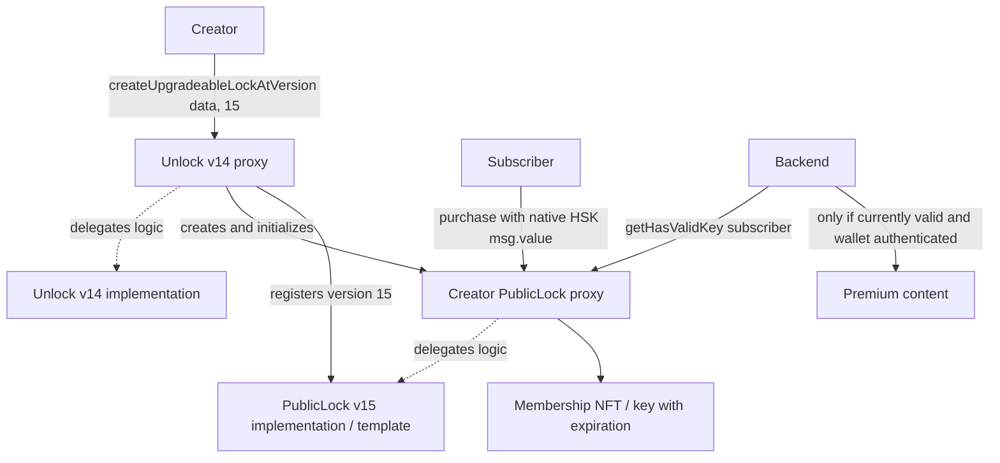

# HSKChain Unlock Contract Review Guide

## 1. What We Built

We brought existing Unlock infrastructure to HSKChain Testnet. We did **not**
rewrite Unlock's membership contracts. This is an **HSKChain-compatible Unlock
deployment**, not official upstream HSK support or a new audit of Unlock.

Our contribution is network/deployment configuration, deploying Unlock v14 and
PublicLock v15, registering/selecting the template, configuring Unlock, creating
a creator lock, purchasing with native HSK, and validating access end to end.
DevVault separately consumes this deployment through its TypeScript library.

**CORE SOLIDITY LOGIC MODIFIED BY OUR BRANCH: NO.** The base was established using
`git merge-base master feat/hashkey-testnet`:
`e887789c433879649c81045423b5291c7796eba0`. This is the available local base, not a
claim that today's remote upstream tip is identical. The committed pre-review
branch diff contains four integration/documentation files and no `.sol` changes.

## 2. Architecture



The template contains shared logic; each creator proxy holds independent state,
keys, permissions, and funds. The backend shown is the intended product flow:
DevVault currently supplies the guard, not a complete backend or content store.

## 3. Upstream vs Our Work

| Component                       | Source                                     | Upstream or ours | Modified? |
| ------------------------------- | ------------------------------------------ | ---------------- | --------- |
| Unlock v14 Solidity             | Versioned source below                     | Upstream         | No        |
| PublicLock v15 Solidity         | Versioned source below                     | Upstream         | No        |
| Deployment tasks/helpers        | Governance and hardhat-helpers             | Upstream         | No        |
| HSK network/export              | networks package                           | Ours             | Added     |
| HSK Hardhat wrapper             | governance config                          | Ours             | Added     |
| Deployment/address registration | Network config and deployment transactions | Ours             | Added     |
| Review scripts and evidence     | scripts/hsk and documentation              | Ours             | Added     |
| DevVault Web3 integration/guard | Separate DevVault repository               | Ours             | Added     |
| Custom Solidity                 | None in DevVault currently                 | Pending          | None      |

## 4. Exact Source Map

All paths below are relative to the Unlock fork root.

| Purpose                            | Exact path                                                                                                                          |
| ---------------------------------- | ----------------------------------------------------------------------------------------------------------------------------------- |
| **Unlock v14 implementation**      | [`packages/contracts/src/contracts/Unlock/UnlockV14.sol`](../packages/contracts/src/contracts/Unlock/UnlockV14.sol)                 |
| **PublicLock v15 implementation**  | [`packages/contracts/src/contracts/PublicLock/PublicLockV15.sol`](../packages/contracts/src/contracts/PublicLock/PublicLockV15.sol) |
| Deployment task parameters         | [`governance/tasks/deploy.js`](../governance/tasks/deploy.js)                                                                       |
| Unlock proxy deployment            | [`governance/scripts/deployments/unlock.js`](../governance/scripts/deployments/unlock.js)                                           |
| Template deployment/initialization | [`governance/scripts/deployments/publicLock.js`](../governance/scripts/deployments/publicLock.js)                                   |
| Version copy/compile selection     | [`packages/hardhat-helpers/src/upgrades.js`](../packages/hardhat-helpers/src/upgrades.js)                                           |
| Deploy/proxy/verification helpers  | [`packages/hardhat-helpers/src/deploy.js`](../packages/hardhat-helpers/src/deploy.js)                                               |
| Template registration/selection    | [`governance/scripts/setters/set-template.js`](../governance/scripts/setters/set-template.js)                                       |
| Unlock configuration               | [`governance/scripts/setters/unlock-config.js`](../governance/scripts/setters/unlock-config.js)                                     |
| HSK network                        | [`packages/networks/src/networks/hashkey-testnet.ts`](../packages/networks/src/networks/hashkey-testnet.ts)                         |
| Named export / Hardhat name        | [`packages/networks/src/networks/index.ts`](../packages/networks/src/networks/index.ts)                                             |
| HSK Hardhat wrapper                | [`governance/hardhat.hashkey-testnet.config.js`](../governance/hardhat.hashkey-testnet.config.js)                                   |
| Deployment record                  | [`HSK_DEPLOYMENT.md`](../HSK_DEPLOYMENT.md)                                                                                         |
| Exact source compilation           | [`governance/scripts/hsk/compile-review.js`](../governance/scripts/hsk/compile-review.js)                                           |
| Read-only runtime/state proof      | [`governance/scripts/hsk/validate-review.js`](../governance/scripts/hsk/validate-review.js)                                         |
| Review validator tests             | [`governance/scripts/hsk/validate-review.test.js`](../governance/scripts/hsk/validate-review.test.js)                               |

The official tasks explicitly select `--unlock-version 14` and
`--public-lock-version 15`. They resolve the files from
`@unlock-protocol/contracts/dist/Unlock/UnlockV14.sol` and
`@unlock-protocol/contracts/dist/PublicLock/PublicLockV15.sol`, copying them to
`governance/contracts/past-versions/` before compiling. These generated files and
artifacts are ignored. The review compiler first compares packaged and tracked
source verbatim. Development sources under `smart-contracts/contracts` are useful
for reading mixins, but are not substituted for the versioned deployment files.

## 5. Deployment Addresses

Chain **133**; native **HSK**, 18 decimals; RPC **https://testnet.hsk.xyz**;
explorer **https://testnet-explorer.hsk.xyz**. These are testnet addresses only.

| Contract / role                 | Address                                      |
| ------------------------------- | -------------------------------------------- |
| Unlock v14 proxy                | `0x56c7b33a4e06e79E7611787170DA26339E58b4Eb` |
| Unlock v14 implementation       | `0x5451C57dA3A8a3f0f04a74475702501628170211` |
| PublicLock v15 template         | `0x04D257Fa68fca523B6709E3A5bcbBA57e8518d5B` |
| Creator lock                    | `0xB212200F82b70d7a93ac3b17eF14E81899d6f2F5` |
| Creator / current Unlock owner  | `0x5b7ED3833EBF4D9899d7aB4799FAF4d40bb6cC65` |
| Test buyer                      | `0x109697F9b1C8FC31461c4eA42F7F12e99301fCbe` |
| Unlock upgrade ProxyAdmin       | `0xaC119D6217Ad0D120bB709473A34248e9a7B3aa2` |
| Creator-lock upgrade ProxyAdmin | `0xe561AE8A2cbCD0Ed26E54A92d540D99F1aeaEB49` |

## 6. Deployment Transactions

The following hashes are the supplied deployment record. The review validator
independently checks the purchase receipt and state; it does not claim to replay
every deployment transaction.

| Operation                 | Explorer transaction                                                                                                                                                         |
| ------------------------- | ---------------------------------------------------------------------------------------------------------------------------------------------------------------------------- |
| Unlock deployment         | [0xa930179977724aff736fd0d8b008983b9d589904d04aa41f50771f46275f5237](https://testnet-explorer.hsk.xyz/tx/0xa930179977724aff736fd0d8b008983b9d589904d04aa41f50771f46275f5237) |
| PublicLock deployment     | [0x247d78f91964752cd17f52686e5887aa8a828d330e73f299595f79cad3031248](https://testnet-explorer.hsk.xyz/tx/0x247d78f91964752cd17f52686e5887aa8a828d330e73f299595f79cad3031248) |
| PublicLock initialization | [0xaa24f847ed9f82a6d59d3af616e498262c36f626f6f54778bf6187b138f7aefb](https://testnet-explorer.hsk.xyz/tx/0xaa24f847ed9f82a6d59d3af616e498262c36f626f6f54778bf6187b138f7aefb) |
| Template manager revoke   | [0xd5db066430e75ff3899a86fd7d3632630e953a6fa620ca972db495f090c88331](https://testnet-explorer.hsk.xyz/tx/0xd5db066430e75ff3899a86fd7d3632630e953a6fa620ca972db495f090c88331) |
| Template registration     | [0x8c1450d582b69c3cbd11f1833f4b5c77e79f3bfe7e8302816e1cf546647486c5](https://testnet-explorer.hsk.xyz/tx/0x8c1450d582b69c3cbd11f1833f4b5c77e79f3bfe7e8302816e1cf546647486c5) |
| Unlock configuration      | [0x42ce856a67ebe4c67e121c4b7024593c3ade645fddb99b9a53034dcb302cce91](https://testnet-explorer.hsk.xyz/tx/0x42ce856a67ebe4c67e121c4b7024593c3ade645fddb99b9a53034dcb302cce91) |
| Creator Lock creation     | [0x2348140b9a267dde434b12afa99d99c935a9a729ec8a127fecc99558b468dbb7](https://testnet-explorer.hsk.xyz/tx/0x2348140b9a267dde434b12afa99d99c935a9a729ec8a127fecc99558b468dbb7) |
| Membership purchase       | [0x04bf5e6f03bf8f6184a6f20bab62aab39007270181c45049709e253376aa2cad](https://testnet-explorer.hsk.xyz/tx/0x04bf5e6f03bf8f6184a6f20bab62aab39007270181c45049709e253376aa2cad) |

## 7. Why Proxy + Implementation Exist

Applications use the **Unlock proxy** as the stable factory address. It delegates
to the Unlock implementation while keeping state in proxy storage. The official
OpenZeppelin deployer creates a transparent proxy initialized with
`initialize(deployerAddress)`. Initialization also creates a distinct ProxyAdmin
for creator-lock upgrades. The top-level Unlock upgrade admin is owned by the
development EOA; the creator-lock admin is owned by the Unlock proxy itself.

The PublicLock implementation is deployed and initialized separately with creator,
zero duration, zero token, zero price, zero capacity and empty name, followed by
revoking its deployer's lock-manager role. `addLockTemplate(template,15)` registers
both mappings; `setLockTemplate(template)` selects the default/latest template.

`createUpgradeableLockAtVersion(data,15)` creates a transparent creator proxy and
runs the encoded initializer in its construction transaction. The proxy's
implementation slot points to the registered PublicLock template. Each proxy has
its own storage; buying on the bare implementation is not buying a creator's key.

Upstream `upgradeLock` requires the caller to be that lock's manager and selects
the next registered version. The factory's own upgrade authority is a broader
trust boundary: changes to factory logic can change its future behavior.

## 8. Membership Flow

1. Deploy Unlock v14 and initialize its proxy owner.
2. Deploy and initialize PublicLock v15; revoke template manager authority.
3. Register/select PublicLock v15 in Unlock.
4. Configure Unlock for chain 133.
5. Creator calls `createUpgradeableLockAtVersion(bytes,uint16)` with version 15.
6. Unlock creates a creator proxy with initializer arguments: creator, duration,
   zero token address, price in wei, maximum memberships, name. Extract `NewLock`.
7. Subscriber calls `purchase` on that proxy with native HSK `msg.value`.
8. PublicLock mints a key/NFT and records expiration and payment.
9. DevVault reads `getHasValidKey(user)` from the confirmed block or a fresh block.
10. A backend must independently check **current** membership for a
    signature-authenticated wallet before loading/returning premium content.

DevVault uses the v15 overload
`purchase((uint256,address,address,address,address,bytes,uint256)[])` with one item:

```js
{
  value: 0n, recipient: buyer,
  referrer: ZeroAddress, protocolReferrer: ZeroAddress,
  keyManager: ZeroAddress, data: '0x', additionalPeriods: 0n,
}
// Transaction value equals keyPrice(). additionalPeriods=0 means ONE period.
```

`tokenAddress=address(0)` selects native HSK. The tuple's value field is ignored
for native payment. The legacy array overload iterates over **recipients**, not
values; empty `_values` is valid for native HSK. No automatic recurring billing
was implemented or demonstrated.

## 9. Security / Trust Model

- **Upstream properties:** initializer guards, transparent proxies, role checks,
  registered version selection, NFT ownership/expiration accounting, purchase
  capacity checks, and insufficient-payment reverts. We have not changed these.
- **Our configuration:** chain 133, native HSK, v14/v15 selection, development EOA
  administration, zero token/oracle integration, no event hooks, price 0.0001 HSK,
  30 days, 100 purchase capacity, one key per address. Unlock protocol fee is zero
  at the reviewed snapshot. Expiry does not burn an NFT; `balanceOf` counts valid
  keys, while `totalSupply` is not a count of currently valid memberships.
- **Authority:** creator lock managers can change pricing/configuration, hooks,
  roles, grant/cancel keys, withdraw funds and request allowed upgrades. Treat a
  publication's lock manager as trusted. Template manager revocation is checked.
- **Upgrade trust (medium operational risk):** a single development EOA owns
  Unlock and its upgrade admin. No multisig/timelock protection is claimed.
- **Reentrancy:** the reviewed purchase entry points have no blanket
  `nonReentrant` modifier. State is recorded before payment callbacks, but
  upstream hooks and native `sendValue` transfers are external-call boundaries.
  Current hooks/referrers/refunds and protocol fee are zero in the proof. Do not
  generalize this review to arbitrary hooks, ERC-20s or callback combinations.
- **Payments:** native HSK is retained by the creator lock, subject to configured
  protocol/referral fees and refunds. Excess native value is permitted as a tip;
  do not promise automatic overpayment refunds.
- **Application boundary:** the guard exists, but authentication, trusted
  publication-to-lock storage and backend routes are not yet implemented. Never
  accept an arbitrary wallet/lock supplied by an unauthenticated request as proof.
  Do not embed premium data in frontend bundles or shared caches.
- **RPC trust:** proofs depend on the RPC serving the stated chain faithfully.
  Cross-check with another node/explorer when needed. Archive-state unavailability
  is a verification infrastructure failure, not evidence of broken contracts.
- DevVault stores no signing keys. Judges need no key or funded wallet.
- **Verification:** the HSK wrapper disables explorer auto-verification because
  shared upstream retry logic can loop on errors. Runtime equality below is
  independent of explorer source verification. The default Locksmith URI is
  stored metadata, not evidence of HSK service support. Subgraph strings remain
  empty; neither service is needed for onchain membership.
- No formal deployment audit, production certification, or mainnet readiness is
  claimed. The review covers this integration, not a full audit of upstream code.

## 10. Functional Proof

Buyer `0x109697F9b1C8FC31461c4eA42F7F12e99301fCbe` purchased in block **32998848**.
The receipt contains `Transfer(address(0),buyer,1)`, Unlock `GNPChanged`, and
`PaymentReceipt` with one purchase, zero extensions, and `100000000000000` paid.
At that block: balance **1**, supply **1**, token #1 owner **buyer**, validity
**true**, lock native balance **0.0001 HSK**. This is a historical proof.

Review snapshot **33004573**: membership remains active, original expiration
timestamp **1791776352**. The validator now separates deployment assertions,
receipt/archive-state proof, and current validity. At normal expiry it reports
**expired test membership** with validity false and valid-key balance zero,
without calling the deployment broken. Changed ownership/inconsistent state is
reported as a changed fixture/error; changed expiration is not labeled natural
expiry. More purchases may change current supply without erasing the original proof.

**Exact runtime correspondence PASS**, including compiler metadata:

| Implementation | Runtime bytes | keccak256(runtime)                                                   |
| -------------- | ------------: | -------------------------------------------------------------------- |
| Unlock v14     |         17369 | `0xb23d3fd597e5644e7d0a9a831360b749e68c14ad50a0a245f0bb6282a7371be8` |
| PublicLock v15 |         24175 | `0x30261ab2d013981572ed65791ba633ba67d359aa0dc29349015e3223db40ff9e` |

Both compile with **solc 0.8.21+commit.d9974bed**, optimizer **enabled, 80 runs**,
EVM **shanghai**, metadata **bytecodeHash: ipfs**. The validator checks the artifact
build-info source against tracked source, compares the full onchain runtime with
the artifact, and exits nonzero on mismatch. It neither strips metadata nor treats
a matching version getter as sufficient proof. Creator and factory proxy runtime
bytecode are not themselves compared; their EIP-1967 implementation/admin slots
are checked. This is source/deployment correspondence, not a security audit.

## 11. Reviewer Commands

Tested with Node 24.15.0 and repository dependencies installed. First-time package
installation/compiler downloads can exceed a five-minute review. There is no need
for the full monorepo build or the unrelated Java/OpenAPI generator.

From the Unlock fork root, inspect the focused diff:

```sh
git diff e887789c433879649c81045423b5291c7796eba0...feat/hashkey-testnet -- '*.sol'
git diff e887789c433879649c81045423b5291c7796eba0...feat/hashkey-testnet -- packages/networks/src/networks/hashkey-testnet.ts packages/networks/src/networks/index.ts governance/hardhat.hashkey-testnet.config.js HSK_DEPLOYMENT.md
git status --short
```

The first command is empty. Uncommitted reviewer files require direct inspection;
they will not appear in a committed three-dot diff until included in a commit.

Build internal prerequisites if absent, then the two targeted workspaces:

```sh
corepack yarn workspace @unlock-protocol/types build
corepack yarn workspace @unlock-protocol/networks build
corepack yarn workspace @unlock-protocol/contracts build
corepack yarn workspace @unlock-protocol/hardhat-helpers build
corepack yarn workspace @unlock-protocol/smart-contracts build
cd governance
corepack yarn hardhat help lock:create --config hardhat.hashkey-testnet.config.js --network hashkeyTestnet
corepack yarn hardhat run scripts/hsk/compile-review.js --config hardhat.hashkey-testnet.config.js --network hardhat --no-compile
node --test scripts/hsk/validate-review.test.js
node scripts/hsk/validate-review.js
```

The compile script blocks RPC and uses no signer. The shared configuration may
print a missing `DEPLOYER_PRIVATE_KEY` warning; it is harmless for these commands.
Do not supply a key. Run in a normal review shell without fork/ZK/Tenderly flags.
The standalone validator does not load Hardhat, reads no keys, and allowlists
only inspection RPC methods. All generated compiler outputs remain ignored.

Optional targeted upstream tests (from fork root; in-memory Hardhat chain only):

```sh
corepack yarn workspace @unlock-protocol/smart-contracts test --network hardhat test/Unlock/createLockAtVersion.js test/Lock/purchaseUsingStruct.js test/Lock/getHasValidKey.js
git diff --check
```

These suites test upstream development contracts; exact deployed-version evidence
is provided by the separate compilation/runtime check. Finish by inspecting the
purchase receipt on the explorer and the separate DevVault judge guide.
